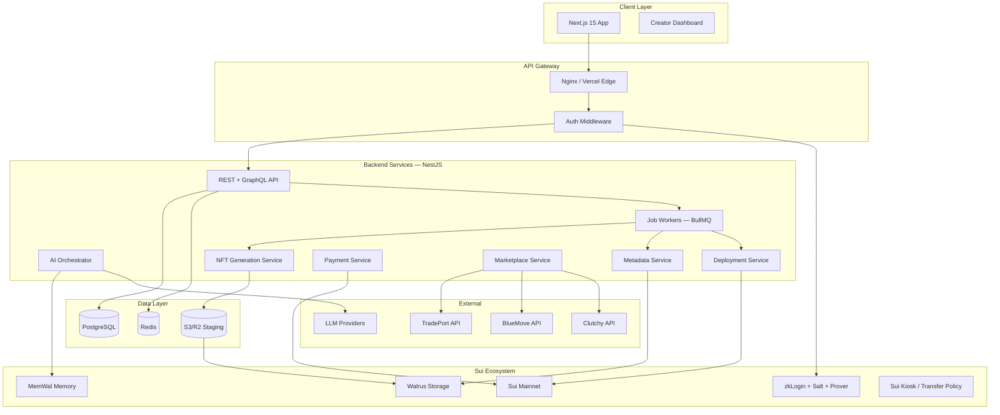
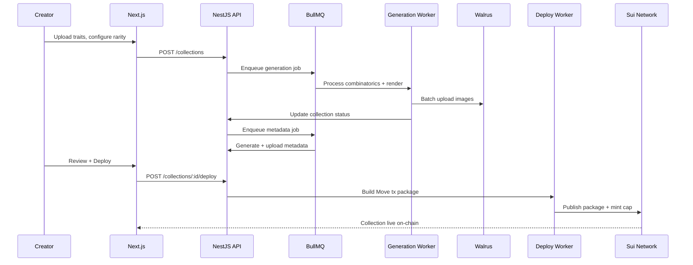
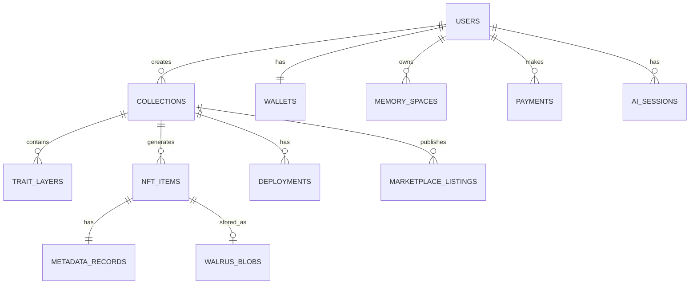
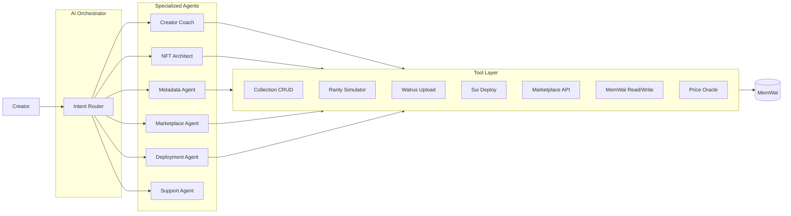
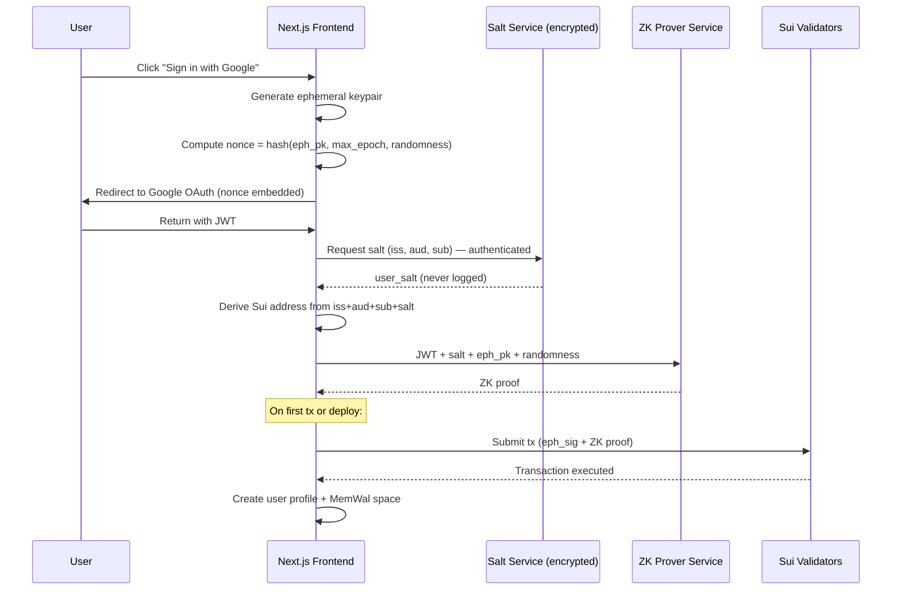
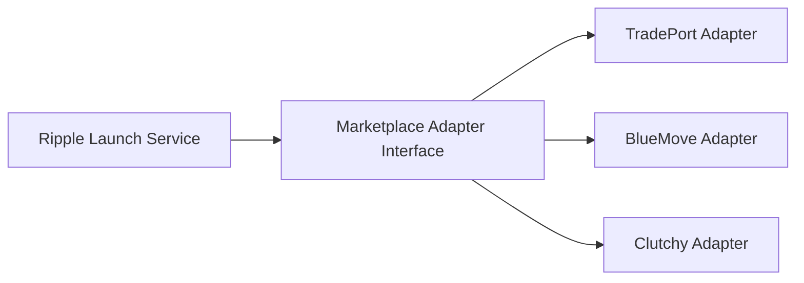
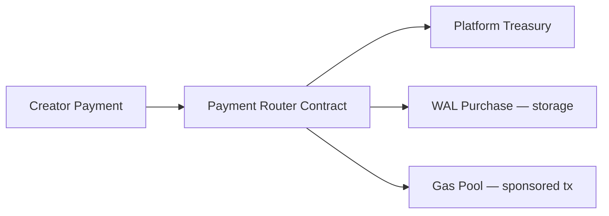

# Ripple Studio — Platform Design Document

**Author:** Founding CTO  
**Date:** June 22, 2026  
**Status:** Draft v1.0  
**Organization:** [Ripple-Studio-Sui](https://github.com/Ripple-Studio-Sui)

---

## Table of Contents

1. [Overview](#overview)
2. [Vision Analysis](#vision-analysis)
3. [Missing Components](#missing-components)
4. [System Architecture](#system-architecture)
5. [Database Structure](#database-structure)
6. [AI Agent Architecture](#ai-agent-architecture)
7. [Walrus Integration Strategy](#walrus-integration-strategy)
8. [MemWal Memory Strategy](#memwal-memory-strategy)
9. [zkLogin Authentication Flow](#zklogin-authentication-flow)
10. [NFT Generation Engine](#nft-generation-engine)
11. [Metadata Engine](#metadata-engine)
12. [Marketplace Deployment Framework](#marketplace-deployment-framework)
13. [Creator Dashboard](#creator-dashboard)
14. [Payment Architecture](#payment-architecture)
15. [Phased Roadmap](#phased-roadmap)
16. [Challenged Assumptions](#challenged-assumptions)
17. [Risks & Mitigations](#risks--mitigations)
18. [Improvements](#improvements)
19. [Key Decisions](#key-decisions)
20. [Open Questions](#open-questions)
21. [PR Plan](#pr-plan)

---

## Overview

Ripple Studio is a no-code, AI-powered NFT creation and deployment platform for the Sui blockchain. It unifies art generation, metadata, decentralized storage (Walrus), on-chain deployment, marketplace publishing, and AI-guided launch strategy into a single creator operating system.

**Positioning:** Canva + Bueno + ChatGPT + Shopify + Sui

**Core thesis:** Remove every technical barrier between a creator's idea and a live NFT collection on Sui.

---

## Vision Analysis

### Strengths

| Strength | Why it matters |
|----------|----------------|
| **End-to-end pipeline** | Competitors (Bueno, LaunchMyNFT) stop at generation or deployment — Ripple covers the full lifecycle |
| **Sui-native stack** | Walrus, MemWal, zkLogin, Kiosk — first-class integration vs. Ethereum-first tools ported to Sui |
| **Persistent AI companion** | MemWal-backed memory creates compounding value; "create another like Cyber Explorers" is a moat |
| **Learning-first UX** | Beginner/Creator/Builder modes reduce churn for non-technical users while serving power users |
| **Multi-token payments** | SUI, LOFI, USDC, USDsui meets creators where they are in the Sui ecosystem |

### Competitive Landscape

| Competitor | Gap Ripple fills |
|------------|------------------|
| **Bueno** | No Sui deployment, no AI, no marketplace, no Walrus |
| **LaunchMyNFT** | Multi-chain but shallow Sui integration, no AI memory |
| **Hyperspace / TradePort** | Marketplace-only — no creation tools |
| **Tensor** | Solana-only |

### Gaps in Current Brief

- No content moderation / IP infringement workflow
- No legal/compliance layer (royalty enforcement, securities guidance)
- No explicit job queue for long-running generation
- Discord/GitHub/X not in official zkLogin provider list (see Auth section)
- No CDN/edge caching strategy for preview UX
- No disaster recovery / backup runbook

---

## Missing Components

These are **required** but not in the original brief:

| Component | Purpose |
|-----------|---------|
| **Job Queue (BullMQ)** | Async NFT generation, Walrus uploads, deployment, metadata batching |
| **Object Storage Buffer (S3/R2)** | Pre-Walrus staging, preview CDN, generation scratch space |
| **Content Moderation** | NSFW detection, duplicate/IP flagging before publish |
| **Rate Limiting** | Per-user API quotas, AI token budgets |
| **Audit Log** | On-chain action trail for compliance |
| **Email/Notification Service** | Deployment complete, marketplace listed, storage low |
| **Feature Flags (LaunchDarkly/Unleash)** | Phased rollout per module |
| **Observability (Datadog/Grafana)** | Traces across AI → Walrus → Sui pipeline |
| **Legal Pages Generator** | Terms, privacy, royalty disclaimers per collection |
| **Salt Backup Service** | Critical for zkLogin — must be first-class, not afterthought |

---

## System Architecture

### High-Level Architecture



### Request Flow — Collection Creation to Mint



### Deployment Topology

| Environment | Frontend | Backend | DB | Workers |
|-------------|----------|---------|-----|---------|
| **Dev** | localhost:3000 | localhost:4000 | Docker PG | Local Redis |
| **Staging** | Vercel Preview | Railway/Fly.io | Neon PG | Upstash Redis |
| **Production** | Vercel | Fly.io (multi-region) | Neon + read replicas | Dedicated worker fleet |

---

## Database Structure

### Entity Relationship Overview



### Core Tables (PostgreSQL)

```sql
-- Users & Identity
CREATE TABLE users (
    id              UUID PRIMARY KEY DEFAULT gen_random_uuid(),
    email           VARCHAR(255),
    display_name    VARCHAR(100),
    avatar_url      TEXT,
    zklogin_iss     VARCHAR(255) NOT NULL,  -- OAuth provider
    zklogin_sub     VARCHAR(255) NOT NULL,  -- OAuth subject
    zklogin_aud     VARCHAR(255) NOT NULL,
    sui_address     VARCHAR(66) NOT NULL UNIQUE,
    salt_ref_id     UUID NOT NULL,          -- reference to encrypted salt store
    experience_mode VARCHAR(20) DEFAULT 'beginner', -- beginner|creator|builder
    tier            VARCHAR(20) DEFAULT 'free',
    created_at      TIMESTAMPTZ DEFAULT NOW(),
    updated_at      TIMESTAMPTZ DEFAULT NOW(),
    UNIQUE(zklogin_iss, zklogin_sub, zklogin_aud)
);

CREATE TABLE wallets (
    id              UUID PRIMARY KEY DEFAULT gen_random_uuid(),
    user_id         UUID REFERENCES users(id) ON DELETE CASCADE,
    sui_address     VARCHAR(66) NOT NULL UNIQUE,
    is_primary      BOOLEAN DEFAULT true,
    created_at      TIMESTAMPTZ DEFAULT NOW()
);

-- Collections
CREATE TABLE collections (
    id              UUID PRIMARY KEY DEFAULT gen_random_uuid(),
    user_id         UUID REFERENCES users(id) ON DELETE CASCADE,
    name            VARCHAR(200) NOT NULL,
    slug            VARCHAR(200) NOT NULL,
    description     TEXT,
    symbol          VARCHAR(10),
    supply          INTEGER NOT NULL,
    status          VARCHAR(30) DEFAULT 'draft',
    -- draft|generating|generated|deploying|deployed|published|archived
    art_style       JSONB,                  -- AI memory snapshot
    royalty_bps     INTEGER DEFAULT 500,    -- 5% default
    mint_price      BIGINT,                 -- in MIST
    mint_currency   VARCHAR(20) DEFAULT 'SUI',
    preview_url     TEXT,
    memwal_space_id VARCHAR(100),
    created_at      TIMESTAMPTZ DEFAULT NOW(),
    updated_at      TIMESTAMPTZ DEFAULT NOW(),
    UNIQUE(user_id, slug)
);

CREATE TABLE trait_layers (
    id              UUID PRIMARY KEY DEFAULT gen_random_uuid(),
    collection_id   UUID REFERENCES collections(id) ON DELETE CASCADE,
    name            VARCHAR(100) NOT NULL,
    display_order   INTEGER NOT NULL,
    is_required     BOOLEAN DEFAULT true,
    blend_mode      VARCHAR(20) DEFAULT 'normal',
    created_at      TIMESTAMPTZ DEFAULT NOW()
);

CREATE TABLE trait_assets (
    id              UUID PRIMARY KEY DEFAULT gen_random_uuid(),
    layer_id        UUID REFERENCES trait_layers(id) ON DELETE CASCADE,
    name            VARCHAR(100) NOT NULL,
    file_path       TEXT NOT NULL,          -- staging path
    walrus_blob_id  VARCHAR(100),
    rarity_weight   INTEGER DEFAULT 100,
    metadata        JSONB,
    created_at      TIMESTAMPTZ DEFAULT NOW()
);

CREATE TABLE nft_items (
    id              UUID PRIMARY KEY DEFAULT gen_random_uuid(),
    collection_id   UUID REFERENCES collections(id) ON DELETE CASCADE,
    token_id        INTEGER NOT NULL,
    name            VARCHAR(200),
    image_blob_id   VARCHAR(100),
    image_url       TEXT,
    trait_hash      VARCHAR(64) NOT NULL,   -- dedup key
    rarity_score    DECIMAL(10,4),
    rarity_rank     INTEGER,
    status          VARCHAR(20) DEFAULT 'pending',
    sui_object_id   VARCHAR(66),
    created_at      TIMESTAMPTZ DEFAULT NOW(),
    UNIQUE(collection_id, token_id),
    UNIQUE(collection_id, trait_hash)
);

CREATE TABLE metadata_records (
    id              UUID PRIMARY KEY DEFAULT gen_random_uuid(),
    nft_item_id     UUID REFERENCES nft_items(id) ON DELETE CASCADE,
    walrus_blob_id  VARCHAR(100),
    metadata_uri    TEXT,
    schema_version  VARCHAR(10) DEFAULT '1.0',
    payload         JSONB NOT NULL,
    created_at      TIMESTAMPTZ DEFAULT NOW()
);

-- Storage
CREATE TABLE walrus_blobs (
    id              UUID PRIMARY KEY DEFAULT gen_random_uuid(),
    blob_id         VARCHAR(100) NOT NULL UNIQUE,
    content_type    VARCHAR(100),
    size_bytes      BIGINT,
    cost_wal        DECIMAL(18,8),
    pinned_until    TIMESTAMPTZ,
    created_at      TIMESTAMPTZ DEFAULT NOW()
);

-- Deployment
CREATE TABLE deployments (
    id              UUID PRIMARY KEY DEFAULT gen_random_uuid(),
    collection_id   UUID REFERENCES collections(id) ON DELETE CASCADE,
    package_id      VARCHAR(66),
    publisher_cap   VARCHAR(66),
    transfer_policy VARCHAR(66),
    kiosk_cap       VARCHAR(66),
    tx_digest       VARCHAR(44),
    network         VARCHAR(20) DEFAULT 'mainnet',
    nft_type        VARCHAR(30) DEFAULT 'standard',
    status          VARCHAR(20) DEFAULT 'pending',
    deployed_at     TIMESTAMPTZ,
    created_at      TIMESTAMPTZ DEFAULT NOW()
);

-- Marketplace
CREATE TABLE marketplace_listings (
    id              UUID PRIMARY KEY DEFAULT gen_random_uuid(),
    collection_id   UUID REFERENCES collections(id) ON DELETE CASCADE,
    marketplace     VARCHAR(30) NOT NULL,   -- tradeport|bluemove|clutchy
    external_id     VARCHAR(100),
    listing_url     TEXT,
    status          VARCHAR(20) DEFAULT 'pending',
    listed_at       TIMESTAMPTZ,
    created_at      TIMESTAMPTZ DEFAULT NOW()
);

-- Payments
CREATE TABLE payments (
    id              UUID PRIMARY KEY DEFAULT gen_random_uuid(),
    user_id         UUID REFERENCES users(id),
    amount          BIGINT NOT NULL,
    currency        VARCHAR(20) NOT NULL,  -- SUI|LOFI|USDC|USDsui
    fee_category    VARCHAR(30) NOT NULL,
    tx_digest       VARCHAR(44),
    status          VARCHAR(20) DEFAULT 'pending',
    created_at      TIMESTAMPTZ DEFAULT NOW()
);

-- AI
CREATE TABLE ai_sessions (
    id              UUID PRIMARY KEY DEFAULT gen_random_uuid(),
    user_id         UUID REFERENCES users(id),
    collection_id   UUID REFERENCES collections(id),
    agent_type      VARCHAR(30),
    memwal_thread_id VARCHAR(100),
    created_at      TIMESTAMPTZ DEFAULT NOW()
);

-- Jobs
CREATE TABLE jobs (
    id              UUID PRIMARY KEY DEFAULT gen_random_uuid(),
    type            VARCHAR(50) NOT NULL,
    payload         JSONB NOT NULL,
    status          VARCHAR(20) DEFAULT 'queued',
    attempts        INTEGER DEFAULT 0,
    error           TEXT,
    created_at      TIMESTAMPTZ DEFAULT NOW(),
    completed_at    TIMESTAMPTZ
);

-- Indexes
CREATE INDEX idx_collections_user ON collections(user_id);
CREATE INDEX idx_collections_status ON collections(status);
CREATE INDEX idx_nft_items_collection ON nft_items(collection_id);
CREATE INDEX idx_nft_items_rarity ON nft_items(collection_id, rarity_rank);
CREATE INDEX idx_jobs_status ON jobs(status) WHERE status IN ('queued', 'processing');
CREATE INDEX idx_payments_user ON payments(user_id, created_at DESC);
```

---

## AI Agent Architecture

### Multi-Agent System



### Agent Responsibilities

| Agent | Role | Tools |
|-------|------|-------|
| **Creator Coach** | Onboarding, education, mode-appropriate explanations | MemWal read, docs RAG |
| **NFT Architect** | Trait structure, lore, theme, supply recommendations | Collection CRUD, rarity sim |
| **Metadata Agent** | Schema validation, attribute naming, Display object | Metadata generator |
| **Marketplace Agent** | Listing strategy, pricing, timing | TradePort/BlueMove/Clutchy APIs |
| **Deployment Agent** | Move package selection, gas estimation, tx building | Sui SDK, deploy service |
| **Support Agent** | Error recovery, status checks | All read-only tools |

### Context Management

1. **System prompt** — Sui ecosystem knowledge base (RAG over docs.sui.io, Walrus, MemWal)
2. **MemWal thread** — Per-user persistent memory (brand voice, past collections, preferences)
3. **Session context** — Current collection state, wizard step, recent actions
4. **Tool results** — Injected as structured JSON, not raw dumps

### Model Strategy

| Task | Model tier | Rationale |
|------|-----------|-----------|
| Coaching / chat | Fast (Haiku-class) | Low latency, high volume |
| Architecture / strategy | Reasoning (Sonnet/Opus-class) | Complex planning |
| Metadata batch | Fast + structured output | JSON mode |
| Marketing copy | Creative mid-tier | Brand voice matching |

---

## Walrus Integration Strategy

### Upload Pipeline

```
Local render → S3 staging (preview) → Walrus publisher → blob_id → PostgreSQL → CDN gateway URL
```

### Blob Lifecycle

| Phase | Action |
|-------|--------|
| **Upload** | Stream to Walrus via `@mysten/walrus` SDK; store blob_id |
| **Pin** | Default 1-year pin; auto-renewal via treasury WAL balance |
| **Version** | New blob_id on re-upload; old blob retained 30 days |
| **Monitor** | Cron checks pin expiry; alert creator at 30/7/1 days |
| **Cost** | ~$0.023/GB/month (USD-denominated, paid in WAL) |

### Failure Recovery

- Upload retry with exponential backoff (3 attempts)
- Partial batch failure → resume from last successful blob
- Walrus outage → queue jobs, serve S3 staging URLs temporarily
- Cost cap per collection → block generation if storage budget exceeded

### URL Strategy

- **On-chain metadata:** `https://walrus.site/blob/{blob_id}` or aggregator gateway
- **Preview/dashboard:** Cloudflare R2 CDN with 24h cache
- **Never** put staging URLs on-chain

---

## MemWal Memory Strategy

### Architecture

```
Agent → @mysten-incubation/memwal SDK → Relayer → Walrus (data) + Sui (ownership)
```

### Memory Spaces Per Creator

| Space | Contents | Retention |
|-------|----------|-----------|
| **profile** | Brand voice, preferred styles, experience mode | Permanent |
| **collections** | Past project summaries, trait patterns, launch outcomes | Permanent |
| **conversations** | AI chat threads with checkpoints | 90 days rolling |
| **preferences** | Marketplace choices, royalty defaults, pricing history | Permanent |
| **reasoning** | Launch strategy traces (builder mode only) | 30 days |

### Privacy Model

- Memory spaces owned by creator's Sui address (via MemWal ownership model)
- Platform cannot read memory without creator consent (access control enforced on Sui)
- Export/delete on account deletion (GDPR)
- **Fallback:** PostgreSQL cache of memory summaries if MemWal beta is unstable

### Example Query Flow

> "Create another collection similar to my Cyber Explorers project but darker"

1. Router → NFT Architect agent
2. MemWal read: `collections` space → filter "Cyber Explorers"
3. Load trait structure, color palette, supply, launch metrics
4. Architect proposes dark-theme variant with diff preview
5. MemWal write: new planning checkpoint

---

## zkLogin Authentication Flow

### Supported Providers (Mainnet — Official)

✅ Google, Apple, Facebook, Twitch, AWS Tenant, Karrier One, Credenza3

### ⚠️ Not Officially Supported

❌ Discord, GitHub, X — **require alternative auth** (Magic Link + embedded wallet, or Enoki SDK bridge)

### Sequence Diagram



### Salt Management (Critical)

| Requirement | Implementation |
|-------------|----------------|
| **Persistence** | AES-256 encrypted in dedicated `salt_vault` table; HSM-backed key |
| **Backup** | User-exportable encrypted backup file on first login |
| **Recovery** | Social recovery via secondary OAuth provider (different iss → linked account) |
| **Loss consequence** | **Permanent loss of Sui address** — must be communicated in onboarding |

### Session Handling

- Ephemeral key in browser `sessionStorage` (not localStorage)
- Auto-refresh ephemeral key before `max_epoch` expiry
- Sponsored transactions for first-time deploy (platform pays gas)
- Backend sessions: JWT (15min) + refresh token (7 days) for API access

---

## NFT Generation Engine

### Pipeline Stages

1. **Ingest** — Validate trait folders (PNG/JPG/SVG/GIF), normalize dimensions
2. **Configure** — Layer order, required/optional, blend modes, rarity weights
3. **Combine** — Cartesian product with constraints; max supply cap
4. **Dedup** — SHA-256 hash of trait combination → reject duplicates
5. **Simulate** — Monte Carlo rarity distribution preview (10k samples)
6. **Render** — Sharp/Canvas compositing; SVG rasterization for vector layers
7. **QA** — Visual diff spot-check, missing layer detection
8. **Upload** — Batch to Walrus (parallel, 50 concurrent)

### Rarity Engine

```
trait_score = Σ (1 / (trait_frequency / supply))
rarity_rank = RANK() OVER (ORDER BY trait_score DESC)
```

- Weighted random selection during generation
- Deterministic mode: seeded PRNG for reproducible collections
- Rarity lock: force specific traits to max N occurrences

### Performance Targets

| Collection Size | Generation Time | Walrus Upload |
|----------------|-----------------|---------------|
| 1,000 NFTs | < 5 min | < 10 min |
| 5,000 NFTs | < 20 min | < 30 min |
| 10,000 NFTs | < 45 min | < 60 min |

Worker scaling: horizontal via BullMQ consumer count.

---

## Metadata Engine

### Sui Display Standard Compatibility

```json
{
  "name": "Cyber Explorer #42",
  "description": "A fearless navigator of the neon void.",
  "image_url": "https://walrus.site/blob/{image_blob_id}",
  "attributes": [
    { "trait_type": "Background", "value": "Neon City" },
    { "trait_type": "Helmet", "value": "Void Visor" }
  ],
  "project_url": "https://ripple.studio/c/cyber-explorers"
}
```

### Generation Rules

- Auto-name: `{collection_name} #{token_id}`
- Description: AI-generated from collection lore + trait combo
- Attributes: mapped 1:1 from trait layers
- Royalty: `TransferPolicy` rule on deploy (creator-configurable bps)
- Batch: 500 metadata files per Walrus upload batch

### Validation

- JSON Schema validation pre-upload
- Image blob_id cross-reference (must exist in `walrus_blobs`)
- On-chain `Display` object fields match off-chain metadata

---

## Marketplace Deployment Framework

### Integration Pattern



### Adapter Interface

```typescript
interface MarketplaceAdapter {
  name: string;
  publishCollection(params: PublishParams): Promise<ListingResult>;
  updateListing(params: UpdateParams): Promise<void>;
  getAnalytics(collectionId: string): Promise<MarketAnalytics>;
  scheduleListing(params: ScheduleParams): Promise<void>;
}
```

### Per-Marketplace Requirements

| Marketplace | Auth | Data needed | Status |
|-------------|------|-------------|--------|
| **TradePort** | API key + collection verification | package_id, type, metadata base URI | Primary |
| **BlueMove** | Partner API | collection object, royalty config | Secondary |
| **Clutchy** | Creator application | Kiosk listing, transfer policy | Tertiary |

### Launch Scheduling

- Cron-based publish at creator-specified datetime
- Pre-launch checklist (AI-generated): metadata ✓, Walrus ✓, deploy ✓, royalty ✓, social posts drafted ✓

---

## Creator Dashboard

### Key Screens

| Screen | Purpose |
|--------|---------|
| **Home** | Active collections, AI chat sidebar, quick actions |
| **Create Wizard** | 5-step: Upload → Layers → Rarity → Preview → Generate |
| **Collection Detail** | Grid preview, rarity chart, metadata tab, deploy button |
| **Deploy Console** | Tx status, gas estimate, network selector, type picker |
| **Launch Center** | Marketplace toggles, schedule, listing status |
| **Insights** | Floor price, volume, holder count (post-launch) |
| **Marketing Studio** | AI-generated posts, copy-to-clipboard, scheduling |
| **Vault** | Storage usage, blob list, cost projection |
| **Settings** | Profile, wallet, experience mode, payment methods |

### State Management

- **Server state:** TanStack Query for API data
- **Wizard state:** Zustand persisted to sessionStorage
- **AI chat:** MemWal-backed, streamed via SSE
- **Real-time:** WebSocket for job progress (generation %, deploy status)

---

## Payment Architecture

### Accepted Tokens

| Token | Type | Use case |
|-------|------|----------|
| **SUI** | Native gas + payment | Default; deployment fees |
| **LOFI** | Sui ecosystem token | Community/creator preference |
| **USDC** | Stablecoin (Wormhole) | Predictable pricing |
| **USDsui** | Sui native stablecoin | Preferred for storage fees |

### Fee Categories

| Category | Pricing model (MVP) |
|----------|---------------------|
| Collection generation | Free ≤500; $0.01/NFT above |
| Walrus storage | Pass-through + 15% margin |
| Deployment | Flat 5 SUI (sponsored for first collection) |
| Premium AI | 50 messages/day free; unlimited at $9.99/mo |
| Marketplace publish | Free (marketplace referral revenue) |

### Treasury Architecture



- Multi-token acceptance via Sui `Coin` objects
- Price oracle: Pyth Network for USD conversion
- Sponsored transactions: platform `GasPool` object for zkLogin users
- Revenue sharing (V1): 2.5% of secondary royalties routed to platform (opt-in)

---

## Phased Roadmap

### Phase 0 — Foundation (Weeks 1–4) → **MVP**

| Deliverable | Scope |
|-------------|-------|
| zkLogin auth | Google + Apple only |
| Collection builder | Upload traits, layer config, preview ≤100 combos |
| Generation | Up to 500 NFTs, PNG only |
| Walrus upload | Images only, manual trigger |
| Metadata | Auto-generate JSON, no on-chain Display yet |
| AI | Single agent (Creator Coach), no MemWal |
| Dashboard | Create wizard + collection grid |

**MVP exit criteria:** Creator can sign in, build a 500-piece collection, store on Walrus, download metadata zip.

### Phase 1 — Alpha (Weeks 5–10)

| Deliverable | Scope |
|-------------|-------|
| Deploy | Standard NFT package to Sui testnet → mainnet |
| MemWal | Creator memory for AI context |
| Multi-agent | Architect + Metadata agents |
| Payments | SUI + USDC for generation fees |
| Rarity engine | Full simulation + ranking |
| Formats | SVG, GIF support |

### Phase 2 — Beta (Weeks 11–18)

| Deliverable | Scope |
|-------------|-------|
| Marketplace | TradePort integration |
| Dynamic NFTs | Template deploy |
| Marketing AI | X/Discord post generation |
| Insights | Basic floor/volume from TradePort |
| Payments | LOFI + USDsui |
| Sponsored tx | Gas pool for new users |

### Phase 3 — V1 (Weeks 19–28)

| Deliverable | Scope |
|-------------|-------|
| Full marketplace | BlueMove + Clutchy |
| NFT types | Membership, Event Tickets, Soulbound, Loyalty |
| Launch scheduling | Cron-based marketplace publish |
| Subscription | Premium AI tier |
| Learning modes | Beginner/Creator/Builder across all features |
| Mobile-responsive | Full dashboard on mobile |

---

## Challenged Assumptions

| Assumption | Challenge | Recommendation |
|------------|-----------|----------------|
| "Discord/GitHub/X zkLogin" | Not on Sui mainnet provider list | Use Google/Apple primary; add Enoki or custom OAuth bridge for others |
| "One-click deploy" | Move packages need auditing; gas costs vary | Wizard with 3 confirmation steps; testnet preview mandatory |
| "MemWal is production-ready" | Still in beta | PostgreSQL fallback cache; abstract behind `MemoryProvider` interface |
| "All marketplaces have APIs" | Clutchy may require manual onboarding | Build adapter interface; manual fallback workflow |
| "Creators want 6 NFT types at launch" | 90% will use standard NFTs | Ship standard first; others as templates in V1 |
| "AI can replace NFT developer" | Complex collections need custom Move | Offer "Ripple Pro" human review for advanced deployments |
| "LOFI as payment" | Volatile memecoin | Accept but display USD equivalent; don't store treasury in LOFI |

---

## Risks & Mitigations

| Risk | Severity | Mitigation |
|------|----------|------------|
| zkLogin salt loss | **Critical** | Encrypted backup + user education + export on day 1 |
| MemWal beta instability | **High** | Fallback memory in PostgreSQL; feature flag |
| Walrus cost overrun | **High** | Pre-generation cost estimator; hard caps per tier |
| IP infringement | **High** | AI similarity detection; DMCA workflow; ToS |
| Move package vulnerability | **Critical** | Audited templates only; no arbitrary Move in MVP |
| Marketplace API changes | **Medium** | Adapter pattern; version pinning |
| AI hallucination on deploy params | **High** | Human confirmation gate before any on-chain tx |
| Token price volatility (LOFI) | **Medium** | Oracle-based USD display; treasury diversification |

---

## Improvements

To become **the** definitive Sui NFT platform:

1. **Ripple Templates Marketplace** — Curated, audited collection templates (PFP, generative art, membership)
2. **Community Ripples** — Co-created collections with split royalties
3. **Sui Kiosk Native** — Deep Kiosk integration for enforced royalties (Sui advantage over ERC-721)
4. **Walrus-verified provenance** — On-chain proof that metadata matches Walrus blob (content addressing)
5. **Creator Grants Program** — Sponsor gas + storage for top collections
6. **Ripple SDK** — Let developers extend with plugins (trait sources, custom metadata resolvers)
7. **Cross-collection AI lore** — Shared universe builder across a creator's portfolio
8. **Sponsored tx by default** — Zero-friction first deploy for zkLogin users
9. **Integration with SuiNS** — Auto `.sui` domain linking in metadata
10. **LOFI partnership** — Official LOFI payment rails with creator cashback

---

## Key Decisions

| # | Decision | Rationale |
|---|----------|-----------|
| 1 | **Monorepo** (Turborepo) | Shared types between Next.js + NestJS; single PR for full features |
| 2 | **NestJS over Fastify raw** | Structured modules map to product domains; DI for agent orchestration |
| 3 | **BullMQ for async jobs** | Generation and Walrus uploads are long-running; need retry/dead-letter |
| 4 | **Google + Apple zkLogin only at MVP** | Only confirmed mainnet providers; avoids auth complexity |
| 5 | **S3/R2 staging before Walrus** | Fast previews; Walrus for permanence only |
| 6 | **MemWal behind abstraction** | Beta risk; swap to PostgreSQL without rewriting agents |
| 7 | **Audited Move templates, no custom Move in MVP** | Security; speed to market |
| 8 | **TradePort first marketplace** | Largest Sui marketplace; best API documentation |
| 9 | **Sponsored first deploy** | zkLogin users have no gas; removes #1 drop-off point |
| 10 | **Pyth oracle for multi-token pricing** | Standard Sui price feeds for USDC/USDsui/SUI conversion |

---

## Open Questions

| # | Question | Options |
|---|----------|---------|
| 1 | Org/repo visibility — public or private? | Public (open source design) / Private (stealth) |
| 2 | Custom domain for platform? | ripple.studio / ripplestudio.sui / TBD |
| 3 | Enoki vs self-hosted zkLogin prover? | Enoki (faster) / Self-hosted (control) |
| 4 | LOFI treasury policy? | Auto-swap to USDC / Hold LOFI |
| 5 | Revenue model priority? | Subscription-first / Per-action fees / Hybrid |

---

## PR Plan

### PR-1: Monorepo Scaffold
- **Files:** `package.json`, `turbo.json`, `apps/web/`, `apps/api/`, `packages/shared/`
- **Deps:** None
- **Description:** Turborepo with Next.js 15 + NestJS skeleton, shared TypeScript config

### PR-2: Database Schema & Migrations
- **Files:** `apps/api/prisma/schema.prisma`, migration files
- **Deps:** PR-1
- **Description:** Full PostgreSQL schema from this document

### PR-3: zkLogin Auth Module
- **Files:** `apps/web/lib/auth/`, `apps/api/src/auth/`, salt service
- **Deps:** PR-2
- **Description:** Google + Apple login, ephemeral key management, user creation

### PR-4: Collection Builder UI
- **Files:** `apps/web/app/create/`, trait upload components
- **Deps:** PR-3
- **Description:** 5-step wizard, layer organizer, preview grid

### PR-5: NFT Generation Worker
- **Files:** `apps/api/src/generation/`, `apps/worker/`
- **Deps:** PR-4
- **Description:** Combinatorics, rendering, dedup, rarity scoring

### PR-6: Walrus Integration
- **Files:** `packages/walrus-client/`, upload pipeline
- **Deps:** PR-5
- **Description:** Batch upload, blob tracking, cost estimation

### PR-7: Metadata Engine
- **Files:** `apps/api/src/metadata/`
- **Deps:** PR-6
- **Description:** Auto-generation, schema validation, batch Walrus upload

### PR-8: AI Orchestrator + Creator Coach
- **Files:** `apps/api/src/ai/`, chat UI sidebar
- **Deps:** PR-3
- **Description:** Single agent MVP, SSE streaming, Sui docs RAG

### PR-9: MemWal Integration
- **Files:** `packages/memory/`, MemWal SDK wrapper
- **Deps:** PR-8
- **Description:** Memory spaces, PostgreSQL fallback, abstraction layer

### PR-10: Multi-Agent Expansion
- **Files:** `apps/api/src/ai/agents/`
- **Deps:** PR-9
- **Description:** Architect, Metadata, Marketplace, Deployment agents

### PR-11: Sui Deployment Service
- **Files:** `packages/move-templates/`, `apps/api/src/deploy/`
- **Deps:** PR-7
- **Description:** Standard NFT Move template, publish + mint cap, testnet

### PR-12: Payment Router
- **Files:** `apps/api/src/payments/`, Move treasury contract
- **Deps:** PR-11
- **Description:** SUI + USDC acceptance, fee calculation, gas pool

### PR-13: Creator Dashboard
- **Files:** `apps/web/app/dashboard/`, insights, vault, settings
- **Deps:** PR-11
- **Description:** Full dashboard with collection management

### PR-14: TradePort Marketplace Adapter
- **Files:** `apps/api/src/marketplace/tradeport/`
- **Deps:** PR-13
- **Description:** Collection publishing, listing management

### PR-15: Marketing AI + Launch Scheduler
- **Files:** `apps/api/src/marketing/`, `apps/web/app/marketing/`
- **Deps:** PR-10, PR-14
- **Description:** Social content generation, scheduled marketplace launch

### PR-16: Learning Modes + Polish
- **Files:** `packages/ui/`, explanation components across app
- **Deps:** All above
- **Description:** Beginner/Creator/Builder mode toggle, final UX polish for V1

---

*End of design document.*